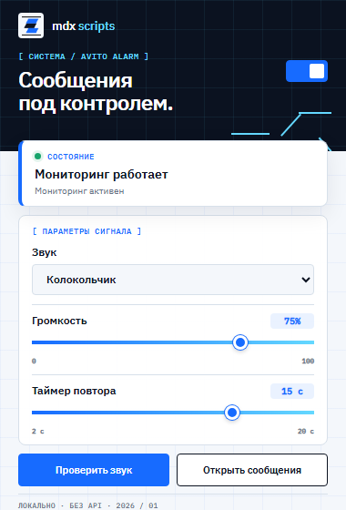
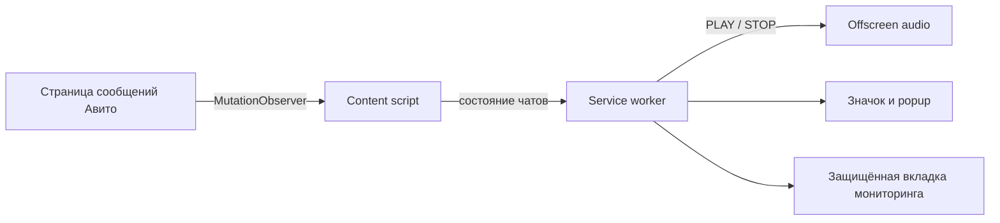

<div align="center">
  
  <h1>Avito Alarm — звуковые уведомления о сообщениях Авито</h1>
  <p><strong>Бесплатное локальное расширение для Chrome, Edge и Яндекс.Браузера, которое не даст пропустить новое сообщение покупателя.</strong></p>

  [](manifest.json)
  [](#установка)
  [](#установка)
  [](#установка)
  [](#разработка-и-тесты)
</div>

Avito Alarm отслеживает непрочитанные входящие сообщения в веб-версии Авито, сразу воспроизводит выбранный звук и повторяет его через заданный интервал, пока сообщение не будет прочитано. Расширение работает локально: без сервера, Avito API, передачи переписки и хранения данных авторизации.

> [!IMPORTANT]
> Это независимый неофициальный проект. Он не связан с ООО «КЕХ еКоммерц» и сервисом Авито.

## Интерфейс

<div align="center">
  
  <br>
  <sub>Состояние мониторинга, выбор сигнала, громкость и интервал повтора находятся в одном компактном окне.</sub>
</div>

Интерфейс сразу показывает, работает ли мониторинг. Основные настройки доступны без перехода на отдельную страницу, а кнопка проверки позволяет убедиться, что выбранный сигнал слышен до начала работы.

## Какие проблемы решает

- **Тихие или незаметные уведомления браузера.** Звук повторяется каждые 2–20 секунд, а не проигрывается один раз.
- **Пропущенные обращения покупателей.** Напоминание продолжается до прочтения последнего отслеживаемого сообщения.
- **Сообщения в фоновой вкладке.** Мониторинг работает, пока браузер запущен, даже если открыта другая вкладка или программа.
- **Случайное нарушение мониторинга.** Служебная вкладка закреплена и защищена; для переписки открывается отдельная рабочая вкладка.
- **Несколько одинаковых сигналов.** Состояние централизовано в service worker, поэтому дубли вкладок и DOM-изменения не умножают уведомления.
- **Разные кабинеты Авито.** Поддерживается обычный интерфейс и Авито Pro, включая индикаторы непрочитанного в разных вариантах разметки.
- **Непонятно, работает ли контроль.** Значок и popup показывают состояние страницы, число непрочитанных чатов, необходимость входа или CAPTCHA.

## Возможности

- мгновенный сигнал о новом входящем сообщении;
- повтор звука до прочтения с интервалом от 2 до 20 секунд;
- три встроенных сигнала и регулировка громкости;
- обнаружение уже имеющихся непрочитанных сообщений после запуска;
- фильтрация системных чатов, рекламы и распознаваемых исходящих сообщений;
- автоматическое создание и восстановление одной закреплённой вкладки мониторинга;
- защита служебной вкладки от случайного открытия диалога;
- отдельная кнопка для открытия рабочей страницы сообщений;
- диагностика выхода из аккаунта, CAPTCHA и изменения структуры страницы;
- работа без backend, аналитики и закрытых внутренних API Авито;
- сохранение настроек после перезапуска браузера.

## Установка

Скачайте репозиторий через **Code → Download ZIP** и распакуйте архив либо клонируйте его:

```bash
git clone https://github.com/Madrasso/avito-alarm.git
```

### Google Chrome

1. Откройте `chrome://extensions`.
2. Включите **Режим разработчика**.
3. Нажмите **Загрузить распакованное расширение**.
4. Выберите папку `avito-alarm`, внутри которой находится `manifest.json`.

### Microsoft Edge

1. Откройте `edge://extensions`.
2. Включите **Режим разработчика**.
3. Нажмите **Загрузить распакованное** и выберите папку проекта.

### Яндекс.Браузер

1. Откройте `browser://extensions`.
2. Включите **Режим разработчика**.
3. Нажмите **Загрузить распакованное расширение** и выберите папку проекта.

Упаковывать расширение в CRX для локальной установки не требуется.

## Как пользоваться

1. Войдите в свой аккаунт Авито в том же профиле браузера.
2. Нажмите значок **Avito Alarm** на панели расширений.
3. Включите мониторинг, выберите звук, громкость и период повтора.
4. Нажмите **Проверить звук**, чтобы убедиться, что системная громкость не отключена.
5. Для чтения и ответа используйте кнопку **Открыть сообщения** — служебную вкладку менять не нужно.

Обозначения на значке:

| Индикатор | Значение |
|---|---|
| `ON` | мониторинг работает, непрочитанных сообщений нет |
| число | количество чатов с активным звуковым напоминанием |
| `…` | вкладка и страница сообщений загружаются |
| `!` | требуется вход, CAPTCHA или обновление распознавания страницы |
| `OFF` | мониторинг отключён |

## Как это работает



Content script анализирует доступную разметку списка чатов и формирует отпечаток из идентификатора диалога, предпросмотра, времени и счётчика. Service worker хранит временное состояние, устраняет дубли и управляет звуком через штатный Chromium Offscreen API.

## Конфиденциальность и разрешения

Расширение не собирает и не отправляет данные. Настройки находятся в `chrome.storage.local`, временное состояние — в `chrome.storage.session`. Логин, пароль, cookies и содержимое переписки на внешних серверах не сохраняются.

| Разрешение | Для чего используется |
|---|---|
| `storage` | настройки и временное состояние уведомлений |
| `tabs` | создание, закрепление и восстановление вкладки мониторинга |
| `offscreen` | фоновое воспроизведение звука штатным способом Chromium |
| `https://www.avito.ru/*` | распознавание сообщений только на страницах Авито |

## Ограничения

- Браузер должен быть запущен, а пользователь — авторизован в Авито.
- Разрешение сайту на показ системных уведомлений не требуется, но звук вкладок и браузера не должен быть отключён в системе.
- Авито может менять интерфейс без предупреждения. При существенном изменении разметки расширению потребуется обновление селекторов.
- После ручного обновления распакованного расширения старые ошибки остаются в журнале браузера до нажатия **Удалить все**, но новый content script перезапускается автоматически.

## Решение проблем

**Сообщение есть, но звука нет**

1. Откройте popup и нажмите **Проверить звук**.
2. Проверьте громкость расширения и выбранный интервал.
3. Убедитесь, что popup показывает **Мониторинг работает**.
4. Проверьте, не отключён ли звук браузера в микшере Windows.
5. На странице расширений нажмите **Обновить**, затем посмотрите, появляются ли новые ошибки.

**Показывается `!`**

Откройте popup: там будет указано, требуется ли войти в аккаунт, пройти проверку безопасности или обновить расширение после изменения страницы Авито.

**В журнале есть `Extension context invalidated`**

Это может быть старая запись от предыдущей версии после её ручной перезагрузки. Удалите журнал и проверьте, возникает ли ошибка снова в версии 1.2.3 или новее.

## Разработка и тесты

Проект написан на обычных JavaScript и CSS без сборщика и runtime-зависимостей. Для тестов требуется Node.js 18 или новее:

```bash
npm test
```

Перед выпуском рекомендуется вручную проверить Chrome, Edge и Яндекс.Браузер: входящее сообщение, повтор сигнала, прочтение, несколько вкладок, закрытие служебной вкладки и восстановление после перезапуска.

## Обратная связь

Если Авито изменил интерфейс или сообщение определяется неверно, создайте [issue](https://github.com/Madrasso/avito-alarm/issues) и приложите:

- название и версию браузера;
- обычный кабинет или Авито Pro;
- диагностический статус из popup;
- скриншот без личной переписки, телефона и других персональных данных.

Pull request с улучшениями также приветствуется.
